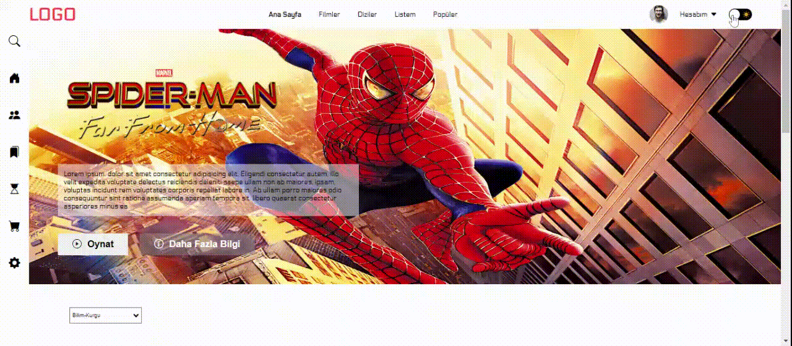

<h1> filmwebsiteproject </h1>

"This project represents a simple movie website designed using HTML, CSS, and JavaScript. The site offers a minimalist and stylish interface that introduces visitors to various films. The use of responsive design and different animations enhances usability."

<h2> The technologies used in the project </h2>

It was coded using HTML, CSS and JavaScprit
technologies.

<h2> Screenshot </h2>

# filmwebsiteproject
